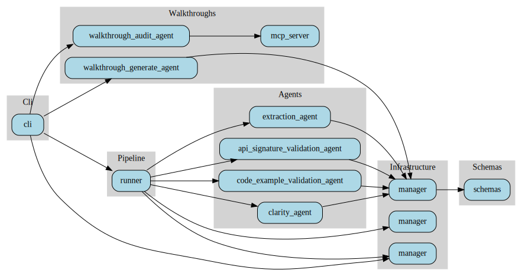
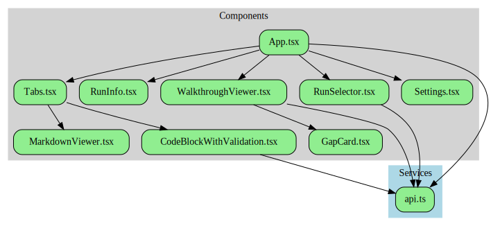

# Stackbench Code Map

**Last Updated**: 2024  
**Total Python LOC**: 8,488  
**Total Frontend LOC**: 2,167

This document provides a detailed map of the Stackbench codebase, including directory structure, primary classes, functions, and cross-references between modules.

---

## Table of Contents

1. [Directory Overview](#directory-overview)
2. [Dependency Graphs](#dependency-graphs)
3. [Python Package Structure](#python-package-structure)
4. [Frontend Structure](#frontend-structure)
5. [Cross-References](#cross-references)
6. [Metrics by Area](#metrics-by-area)
7. [Generating the Codemap](#generating-the-codemap)

---

## Dependency Graphs

Visual representations of module and component dependencies in the codebase.

### Python Module Dependencies



This graph shows:
- **CLI** → Orchestrates pipeline and walkthroughs
- **Pipeline** → Coordinates all agents and infrastructure
- **Agents** → Core validation logic (extraction, API, code, clarity)
- **Walkthroughs** → Tutorial validation system with MCP server
- **Infrastructure** → Cache, repository, hooks support all agents
- **Schemas** → Data models used throughout

### Frontend Component Dependencies



This graph shows:
- **App.tsx** → Main application orchestrator
- **Components** → UI elements (RunSelector, Tabs, CodeBlock, etc.)
- **Services** → API layer for file system access
- All components use the shared API service

---

## Directory Overview

```
stackbench/
├── stackbench/                   # Python package (8,488 LOC)
│   ├── agents/                   # Validation agents (3,293 LOC)
│   ├── walkthroughs/             # Walkthrough system (1,379 LOC)
│   ├── pipeline/                 # Pipeline orchestration (482 LOC)
│   ├── repository/               # Git operations (559 LOC)
│   ├── hooks/                    # Validation + logging hooks (~500 LOC)
│   ├── cache/                    # Caching system (254 LOC)
│   ├── mcp_servers/              # MCP servers
│   ├── utils/                    # Utilities
│   ├── cli.py                    # CLI entry point (728 LOC)
│   └── schemas.py                # Pydantic models (~400 LOC)
├── frontend/                     # React web UI (2,167 LOC)
│   ├── src/
│   │   ├── components/           # React components
│   │   ├── services/             # API layer
│   │   └── types/                # TypeScript types
│   ├── vite-plugin-local-fs.ts   # Custom Vite plugin
│   └── vite.config.ts
├── tests/                        # Test suite
├── docs/                         # Documentation
│   ├── ARCHITECTURE.md           # System architecture
│   ├── CODEMAP.md                # This file
│   └── 0-plan.md                 # Feature roadmap
├── data/                         # Output directory (gitignored)
│   ├── runs.json                 # Cache index
│   └── <run_id>/                 # Run-specific data
├── pyproject.toml                # Python project config
├── uv.lock                       # UV lock file
└── README.md                     # Project overview
```

---

## Python Package Structure

### 1. CLI Module (`stackbench/cli.py`)

**LOC**: 728  
**Dependencies**: `typer`, `rich`, `asyncio`, `pipeline.runner`, `walkthroughs/*`, `repository.manager`

#### Commands

| Command | Function | Lines | Description |
|---------|----------|-------|-------------|
| `run` | `run()` | 34-146 | Core documentation validation pipeline |
| `rerun-clarity` | `rerun_clarity()` | 198-274 | Re-run clarity validation only |
| `version` | `version()` | 277-280 | Show Stackbench version |
| `walkthrough generate` | `walkthrough_generate()` | 294-478 | Generate walkthrough from docs |
| `walkthrough audit` | `walkthrough_audit()` | 480-612 | Execute walkthrough step-by-step |
| `walkthrough run` | `walkthrough_run()` | 614-728 | Full walkthrough pipeline |

#### Key Functions

```python
# lines 33-146
def run(
    repo: str,
    branch: str,
    commit: Optional[str],
    docs_path: str,
    include_folders: Optional[str],
    library: str,
    version: str,
    output: Optional[str],
    num_workers: int,
    force: bool
) -> None:
    """Run complete documentation validation pipeline."""
    # Creates DocumentationValidationPipeline
    # Handles cache checking
    # Displays rich console output

# lines 148-159
async def _run_pipeline(...) -> None:
    """Run the validation pipeline with worker pool."""
    # Orchestrates pipeline execution
    # Aggregates results
```

#### Imports
- `DocumentationValidationPipeline` → `stackbench.pipeline.runner`
- `WalkthroughGenerateAgent` → `stackbench.walkthroughs.walkthrough_generate_agent`
- `WalkthroughAuditAgent` → `stackbench.walkthroughs.walkthrough_audit_agent`
- `RepositoryManager` → `stackbench.repository`

---

### 2. Pipeline Module (`stackbench/pipeline/`)

#### `runner.py`

**LOC**: 482  
**Dependencies**: `asyncio`, `rich`, `repository.manager`, `cache.manager`, `agents/*`

**Primary Class**: `DocumentationValidationPipeline`

```python
# lines 33-481
class DocumentationValidationPipeline:
    """Orchestrates the complete documentation validation pipeline."""
    
    # lines 36-81
    def __init__(self, repo_url, branch, library_name, library_version, ...):
        """Initialize pipeline with configuration."""
        # Sets up RepositoryManager, CacheManager
        # Generates unique run_id
    
    # lines 83-149
    async def clone_repository(self) -> RunContext:
        """Clone repository and set up run directory structure."""
        # Calls RepositoryManager.clone_repository()
        # Discovers markdown files
        # Creates output directories
    
    # lines 152-181
    async def _estimate_and_sort_documents(self, md_files: List[Path]) -> List[Path]:
        """Sort documents by size (largest first) to minimize idle worker time."""
        # Uses file size as proxy for processing time
    
    # lines 183-269
    async def _process_document_end_to_end(self, doc_file: Path) -> Dict[str, Any]:
        """Run complete validation for a single document (4 stages)."""
        # Stage 1: Extraction
        # Stage 2: API Validation
        # Stage 3: Code Validation
        # Stage 4: Clarity Validation
    
    # lines 271-332
    async def _worker_with_progress(self, worker_id, document_queue, progress, overall_task):
        """Worker that processes documents from queue with progress updates."""
        # Takes documents from shared queue
        # Calls _process_document_end_to_end()
        # Updates Rich progress bar
    
    # lines 334-481
    async def run(self, force: bool = False) -> Dict[str, Any]:
        """Run the complete pipeline using worker pool pattern."""
        # Step 0: Cache check (if not force)
        # Step 1: Clone repository
        # Step 2: Find markdown files
        # Step 3: Sort documents
        # Step 4: Create shared queue
        # Step 5: Launch workers with asyncio.gather()
        # Step 6: Aggregate results
        # Step 7: Update cache status
```

**Cross-References**:
- Uses `RepositoryManager` → `stackbench.repository.manager`
- Uses `CacheManager` → `stackbench.cache.manager`
- Uses agents → `stackbench.agents.*`

---

### 3. Agents Module (`stackbench/agents/`)

**Total LOC**: 3,293

#### `extraction_agent.py`

**LOC**: 661  
**Primary Class**: `DocumentationExtractionAgent`

```python
# lines 30-660
class DocumentationExtractionAgent:
    """Extract API signatures and code examples from documentation."""
    
    # lines 32-70
    def __init__(self, docs_folder, output_folder, repo_root, default_version, num_workers, validation_log_dir):
        """Initialize extraction agent."""
    
    # lines 72-150
    async def process_document(self, doc_file: Path, library_name: str) -> Optional[ExtractionSummary]:
        """Process a single document."""
        # Creates Claude Code agent with hooks
        # Constructs detailed prompt
        # Handles MkDocs Material snippet syntax
        # Returns ExtractionSummary
    
    # lines 152-250
    async def analyze_all_documents(self) -> Dict[str, Any]:
        """Analyze multiple documents in parallel using worker pool."""
        # Creates document queue
        # Spawns num_workers async workers
        # Aggregates results
    
    # lines 252-300
    def _build_extraction_prompt(self, doc_file, library_name, doc_content) -> str:
        """Build detailed prompt for extraction agent."""
        # Includes schema examples
        # Handles snippet includes
```

**Key Features**:
- Parallel document processing (configurable workers)
- Schema validation via hooks
- MkDocs Material snippet preprocessing
- Detailed JSON output

**Cross-References**:
- Uses `HookManager` → `stackbench.hooks.manager`
- Uses `ExtractionResult` schema → `stackbench.schemas`
- Used by `DocumentationValidationPipeline` → `stackbench.pipeline.runner`

#### `api_signature_validation_agent.py`

**LOC**: 790  
**Primary Class**: `APISignatureValidationAgent`

```python
# lines 25-789
class APISignatureValidationAgent:
    """Validate documented API signatures against actual library implementation."""
    
    # lines 27-50
    def __init__(self, extraction_folder, output_folder, num_workers, validation_log_dir):
        """Initialize API validation agent."""
    
    # lines 52-150
    async def validate_document(self, extraction_file: Path) -> Dict[str, Any]:
        """Validate API signatures for a single document."""
        # Reads extraction JSON
        # Creates isolated Python environment
        # Uses inspect.signature() for ground truth
        # Compares parameters, types, defaults
        # Reports mismatches
    
    # lines 152-250
    async def validate_all_documents(self) -> Dict[str, Any]:
        """Validate all documents (sequential processing)."""
        # Processes extraction files one by one
        # Each requires library installation
    
    # lines 252-350
    def _compare_signatures(self, documented, actual):
        """Compare documented vs actual API signature."""
        # Checks parameter names, types, defaults
        # Returns list of issues
```

**Key Features**:
- Dynamic code introspection
- Isolated Python environments
- Detailed mismatch reporting
- Detects phantom APIs

**Cross-References**:
- Reads extraction output from `DocumentationExtractionAgent`
- Uses validation hooks → `stackbench.hooks.validation`
- Used by `DocumentationValidationPipeline`

#### `code_example_validation_agent.py`

**LOC**: 587  
**Primary Class**: `CodeExampleValidationAgent`

```python
# lines 20-586
class CodeExampleValidationAgent:
    """Validate code examples by executing them in isolated environments."""
    
    # lines 22-45
    def __init__(self, extraction_output_folder, validation_output_folder, num_workers, validation_log_dir):
        """Initialize code validation agent."""
    
    # lines 47-140
    async def validate_document(self, extraction_file: Path) -> Dict[str, Any]:
        """Validate code examples for a single document."""
        # Reads extraction JSON
        # Creates fresh Python env per example
        # Executes code with timeout
        # Captures stdout/stderr
        # Reports success/failure
    
    # lines 142-220
    async def validate_all_documents(self) -> Dict[str, Any]:
        """Validate all documents (sequential processing)."""
    
    # lines 222-300
    def _execute_code_example(self, code: str, language: str, timeout: int) -> Dict:
        """Execute a single code example."""
        # Handles Python, JavaScript, Bash
        # Subprocess isolation
        # Timeout protection
```

**Key Features**:
- Isolated execution environments
- Multi-language support (Python primary)
- Timeout handling
- Detailed error reporting

**Cross-References**:
- Reads extraction output from `DocumentationExtractionAgent`
- Used by `DocumentationValidationPipeline`

#### `clarity_agent.py`

**LOC**: 1,115  
**Primary Class**: `DocumentationClarityAgent`

```python
# lines 35-1114
class DocumentationClarityAgent:
    """Validate documentation clarity using LLM-as-judge with MCP scoring."""
    
    # lines 37-75
    def __init__(self, extraction_folder, output_folder, repository_folder, num_workers, validation_log_dir):
        """Initialize clarity agent."""
    
    # lines 77-180
    async def analyze_document(self, extraction_file: Path) -> Dict[str, Any]:
        """Analyze clarity for a single document."""
        # Reads extraction metadata
        # Reads original markdown
        # Pre-processes MkDocs snippets
        # Optionally reads API/code validation results
        # Sends to MCP scoring server
        # Returns 6-dimensional scores + issues
    
    # lines 182-280
    async def analyze_all_documents(self) -> Dict[str, Any]:
        """Analyze multiple documents in parallel using worker pool."""
        # Creates document queue
        # Spawns num_workers async workers
        # Aggregates results
    
    # lines 282-380
    def _preprocess_mkdocs_snippets(self, content: str, repo_folder: Path) -> str:
        """Pre-process MkDocs Material '--8<--' snippet includes."""
        # Reads external files
        # Resolves relative paths
        # Inlines content
    
    # lines 382-450
    def _build_clarity_prompt(self, doc_content, extraction_metadata) -> str:
        """Build prompt for clarity validation."""
        # Includes scoring rubric
        # References validation results
        # Requests actionable feedback
```

**Key Features**:
- Parallel processing (configurable workers)
- MCP server for structured scoring
- MkDocs Material snippet preprocessing
- Multi-dimensional scoring (6 dimensions)
- Granular location reporting

**Cross-References**:
- Reads extraction output from `DocumentationExtractionAgent`
- Uses MCP server → `stackbench.mcp_servers.clarity_scoring_server`
- Used by `DocumentationValidationPipeline`

#### `clarity_helpers.py`

**LOC**: 72  
**Helper Functions**:

```python
# lines 5-20
def preprocess_mkdocs_snippets(content: str, repo_folder: Path) -> str:
    """Resolve MkDocs Material snippet includes."""

# lines 22-40
def extract_snippet_paths(content: str) -> List[str]:
    """Extract all snippet file paths from content."""

# lines 42-72
def inline_snippet_file(snippet_path: str, repo_folder: Path) -> str:
    """Read and return content of snippet file."""
```

**Cross-References**:
- Used by `DocumentationClarityAgent`

---

### 4. Walkthroughs Module (`stackbench/walkthroughs/`)

**Total LOC**: 1,379

#### `schemas.py`

**LOC**: 191  
**Pydantic Models**:

```python
# lines 10-50
class WalkthroughStep(BaseModel):
    """Single step in a walkthrough."""
    stepNumber: int
    contentForUser: str
    contextForAgent: str
    operationsForAgent: List[str]
    introductionForAgent: str

# lines 52-80
class WalkthroughExport(BaseModel):
    """Complete walkthrough export."""
    walkthroughId: str
    title: str
    description: str
    estimatedDurationMinutes: int
    prerequisites: List[str]
    steps: List[WalkthroughStep]
    metadata: WalkthroughMetadata

# lines 82-120
class Gap(BaseModel):
    """Documentation gap identified during audit."""
    category: Literal["clarity", "prerequisite", "logical_flow", "execution", "completeness", "cross_reference"]
    severity: Literal["critical", "warning", "info"]
    stepNumber: int
    description: str
    suggestedFix: Optional[str]

# lines 122-150
class AuditResult(BaseModel):
    """Result of walkthrough audit."""
    walkthroughId: str
    status: Literal["completed", "failed", "partial"]
    gaps: List[Gap]
    executionSummary: Dict[str, Any]
    timestamp: str
```

**Cross-References**:
- Used by `WalkthroughGenerateAgent`
- Used by `WalkthroughAuditAgent`
- Validated by hooks

#### `walkthrough_generate_agent.py`

**LOC**: 354  
**Primary Class**: `WalkthroughGenerateAgent`

```python
# lines 25-353
class WalkthroughGenerateAgent:
    """Generate structured walkthroughs from tutorial documentation."""
    
    # lines 27-45
    def __init__(self, output_folder, library_name, library_version):
        """Initialize generate agent."""
    
    # lines 47-150
    async def generate_walkthrough(self, doc_path: Path, walkthrough_id: str) -> Path:
        """Generate walkthrough from documentation file."""
        # Reads tutorial markdown
        # Creates Claude Code agent with hooks
        # Extracts logical steps
        # Validates against WalkthroughExport schema
        # Writes walkthrough.json
    
    # lines 152-250
    def _build_generation_prompt(self, doc_content: str) -> str:
        """Build prompt for walkthrough generation."""
        # Includes schema definition
        # Emphasizes 4 content fields per step
        # Requests structured JSON output
```

**Key Features**:
- Converts tutorials to structured JSON
- 4-field step structure
- Schema validation via hooks
- Logs all operations

**Cross-References**:
- Uses `WalkthroughExport` → `stackbench.walkthroughs.schemas`
- Uses hooks → `stackbench.hooks.manager`
- Invoked by CLI → `stackbench.cli`

#### `walkthrough_audit_agent.py`

**LOC**: 387  
**Primary Class**: `WalkthroughAuditAgent`

```python
# lines 22-386
class WalkthroughAuditAgent:
    """Audit walkthroughs by executing them step-by-step."""
    
    # lines 24-45
    def __init__(self, output_folder, working_dir, library_name, library_version):
        """Initialize audit agent."""
    
    # lines 47-150
    async def audit_walkthrough(self, walkthrough_path: Path) -> Path:
        """Audit a walkthrough by executing it."""
        # Starts MCP server
        # Creates Claude Code agent
        # Connects to MCP server
        # Iterates through steps
        # Reports gaps via MCP tools
        # Writes audit.json
    
    # lines 152-220
    def _build_audit_prompt(self, walkthrough_id: str) -> str:
        """Build prompt for audit agent."""
        # Instructs agent to use MCP tools
        # Emphasizes gap detection
        # Requests detailed reporting
```

**Key Features**:
- Step-by-step execution
- MCP server integration
- 6-category gap detection
- Simulates real developer experience

**Cross-References**:
- Uses `WalkthroughMCPServer` → `stackbench.walkthroughs.mcp_server`
- Uses `AuditResult` → `stackbench.walkthroughs.schemas`
- Invoked by CLI → `stackbench.cli`

#### `mcp_server.py`

**LOC**: 410  
**Primary Class**: `WalkthroughMCPServer`

```python
# lines 25-409
class WalkthroughMCPServer:
    """MCP server for controlled walkthrough step delivery."""
    
    # lines 27-50
    def __init__(self, walkthrough_path: Path):
        """Initialize MCP server with walkthrough JSON."""
    
    # lines 52-100
    @mcp.tool()
    async def start_walkthrough(self) -> Dict[str, Any]:
        """Start walkthrough and return first step."""
        # Loads walkthrough.json
        # Initializes session
        # Returns step 1
    
    # lines 102-150
    @mcp.tool()
    async def next_step(self) -> Dict[str, Any]:
        """Get next step in walkthrough."""
        # Advances step counter
        # Returns next step or completion message
    
    # lines 152-200
    @mcp.tool()
    async def report_gap(self, category, severity, description, suggested_fix) -> Dict[str, Any]:
        """Report a gap found during audit."""
        # Validates gap data
        # Adds to gap list
        # Returns confirmation
    
    # lines 202-250
    @mcp.tool()
    async def walkthrough_status(self) -> Dict[str, Any]:
        """Get current walkthrough status."""
        # Returns current step, total steps, gaps found
    
    # lines 252-300
    async def start_server(self):
        """Start MCP server on stdio."""
        # Runs stdio transport
        # Handles agent connections
```

**Key Features**:
- Stdio communication
- Sequential step delivery
- Gap reporting tools
- Session state management

**Cross-References**:
- Used by `WalkthroughAuditAgent`
- Uses `WalkthroughExport`, `Gap` → `stackbench.walkthroughs.schemas`

---

### 5. Cache Module (`stackbench/cache/`)

#### `manager.py`

**LOC**: 254  
**Primary Class**: `CacheManager`

```python
# lines 13-253
class CacheManager:
    """Manages run caching using a JSON-based index."""
    
    # lines 16-30
    def __init__(self, data_dir: Path):
        """Initialize cache manager."""
        # Sets cache_file = data_dir / "runs.json"
        # Creates file if doesn't exist
    
    # lines 46-69
    def _generate_cache_key(self, repo_url, doc_commit_hash, docs_path, library_name, library_version) -> str:
        """Generate unique cache key."""
        # Format: repo_url:commit_hash:docs_path:library:version
    
    # lines 71-110
    def get_cached_run(self, ...) -> Optional[str]:
        """Check if a run exists in cache."""
        # Generates cache key
        # Searches runs.json
        # Returns run_id if match found
    
    # lines 112-170
    def add_run(self, run_id, repo_url, branch, doc_commit_hash, ...) -> None:
        """Add a run to the cache."""
        # Creates run entry
        # Appends to runs.json
        # Sorts by timestamp
    
    # lines 172-186
    def update_run_status(self, run_id: str, status: str) -> None:
        """Update the status of a run."""
        # Finds run by ID
        # Updates status field
    
    # lines 188-212
    def list_runs(self, repo_url=None, library_name=None) -> List[Dict]:
        """List all cached runs, optionally filtered."""
    
    # lines 214-229
    def get_run_metadata(self, run_id: str) -> Optional[Dict]:
        """Get metadata for a specific run."""
    
    # lines 231-253
    def invalidate_cache(self, run_id: str) -> bool:
        """Remove a run from the cache."""
```

**Key Features**:
- JSON-based storage
- Unique cache keys
- Run metadata indexing
- Status tracking

**Cross-References**:
- Used by `DocumentationValidationPipeline` → `stackbench.pipeline.runner`

---

### 6. Repository Module (`stackbench/repository/`)

#### `manager.py`

**LOC**: 559  
**Primary Classes**: `RunContext`, `RepositoryManager`

```python
# lines 13-161
class RunContext:
    """Context for managing API signature analysis runs."""
    
    # lines 16-59
    def __init__(self, run_id, repo_url, base_data_dir, ...):
        """Initialize run context."""
        # Sets directory paths
        # Initializes metadata
    
    # lines 61-73
    @classmethod
    def create(cls, repo_url, base_data_dir, analysis_type) -> "RunContext":
        """Create a new run context with unique run ID."""
    
    # lines 75-83
    def create_directories(self) -> None:
        """Create necessary directories for the run."""
    
    # lines 85-112
    def save_metadata(self) -> None:
        """Save run context metadata to JSON file."""
        # Writes metadata.json
    
    # lines 114-123
    def mark_clone_completed(self) -> None:
        """Mark repository cloning as completed."""
    
    # lines 119-123
    def mark_analysis_completed(self) -> None:
        """Mark analysis as completed."""
    
    # lines 125-161
    @classmethod
    def load(cls, run_id: str, base_data_dir: Path) -> "RunContext":
        """Load existing run context by ID."""

# lines 164-558
class RepositoryManager:
    """Manages repository cloning and run organization."""
    
    # lines 167-170
    def __init__(self, base_data_dir: Optional[Path] = None):
        """Initialize repository manager with data directory."""
    
    # lines 172-218
    @staticmethod
    def resolve_commit_hash(repo_url, branch, commit=None) -> str:
        """Resolve commit hash from branch HEAD if not provided."""
        # Shallow clones repository
        # Gets HEAD commit hash
        # Cleanup temp directory
    
    # lines 220-301
    def clone_repository(self, repo_url, branch, run_id, library_name, library_version, commit, docs_path, include_folders) -> RunContext:
        """Clone repository and set up run directory structure."""
        # Resolves commit hash
        # Creates RunContext
        # Clones repository
        # Checks out specific commit if provided
        # Cleans up non-essential files
    
    # lines 303-343
    def cleanup_for_signature_analysis(self, repo_dir: Path) -> None:
        """Remove files not needed for signature analysis."""
        # Keeps: .py, .md, .mdx, .toml, .json, .yaml, .yml, .txt, .rst
        # Preserves: .git directory
        # Removes: All other files
    
    # lines 345-378
    def find_python_files(self, context: RunContext) -> List[Path]:
        """Find all Python files in the cloned repository."""
        # Skips: tests, __pycache__, node_modules, .venv
    
    # lines 380-477
    def find_markdown_files(self, context: RunContext, include_folders=None) -> Dict[str, Any]:
        """Find markdown files that likely contain API documentation."""
        # Filters by include_folders
        # Excludes: changelog, license, etc.
        # Filters out API reference pages (auto-generated)
        # Returns: files, total_found, in_include_folders, filtered_api_reference
    
    # lines 479-490
    def _should_exclude_document(self, file_path: Path) -> bool:
        """Check if a document should be excluded from analysis."""
    
    # lines 492-558
    def _is_api_reference_page(self, file_path: Path) -> bool:
        """Detect if a markdown file is an auto-generated API reference page."""
        # Looks for MkDocs Material ':::' directives
```

**Key Features**:
- Git operations (clone, checkout)
- Commit hash resolution
- Markdown file discovery
- API reference page detection
- Run context management

**Cross-References**:
- Used by `DocumentationValidationPipeline` → `stackbench.pipeline.runner`
- Used by CLI → `stackbench.cli`

---

### 7. Hooks Module (`stackbench/hooks/`)

**Total LOC**: ~500

#### `manager.py`

**LOC**: 109  
**Primary Class**: `HookManager`

```python
# lines 19-108
class HookManager:
    """Manages all hooks for an agent (validation + logging)."""
    
    # lines 22-41
    def __init__(self, agent_type, logger=None, output_dir=None, validation_log_dir=None):
        """Initialize the hook manager."""
    
    # lines 43-86
    def create_hooks(self) -> Dict[str, Any]:
        """Create combined hooks configuration for the agent."""
        # Adds validation hooks for agent_type
        # Adds logging hooks if logger provided
        # Returns PreToolUse + PostToolUse hooks

# lines 89-108
def create_agent_hooks(agent_type, logger=None, output_dir=None, validation_log_dir=None) -> Dict[str, Any]:
    """Convenience function to create hooks for an agent."""
```

**Cross-References**:
- Used by all agents
- Uses validation hooks → `stackbench.hooks.validation`
- Uses logging hooks → `stackbench.hooks.logging`

#### `validation.py`

**LOC**: ~200 (estimated)  
**Hook Functions**:

```python
def create_extraction_validation_hook(output_dir, log_dir):
    """Validate extraction outputs against ExtractionResult schema."""
    # Returns PreToolUse hook
    # Validates JSON against Pydantic schema
    # Blocks invalid writes

def create_validation_output_hook(output_dir, log_dir):
    """Validate API/code/clarity outputs against respective schemas."""
    # Returns PreToolUse hook
    # Validates JSON against schema
    # Blocks invalid writes
```

**Cross-References**:
- Uses schemas → `stackbench.schemas`
- Used by `HookManager`

#### `logging.py` and `logging_manager.py`

**LOC**: ~200 (combined, estimated)  
**Primary Class**: `AgentLogger`

```python
class AgentLogger:
    """Logger for agent tool calls."""
    
    def log_pre_tool_use(self, tool_name, input_data):
        """Log before tool execution."""
        # Writes to .log (human-readable)
        # Writes to .jsonl (machine-readable)
    
    def log_post_tool_use(self, tool_name, output_data):
        """Log after tool execution."""
        # Writes to .log (human-readable)
        # Writes to .jsonl (machine-readable)

def create_logging_hooks(logger: AgentLogger):
    """Create PreToolUse and PostToolUse logging hooks."""
    # Returns hook configuration
```

**Cross-References**:
- Used by `HookManager`
- Used by all agents

---

### 8. Schemas Module (`stackbench/schemas.py`)

**LOC**: ~400 (estimated)  
**Pydantic Models**:

```python
# Core pipeline schemas
class Parameter(BaseModel):
    name: str
    type: Optional[str]
    default: Any
    required: bool

class APISignature(BaseModel):
    function_name: str
    parameters: List[Parameter]
    return_type: Optional[str]
    description: Optional[str]
    location: Location

class CodeExample(BaseModel):
    language: str
    code: str
    context: Optional[str]
    location: Location

class ExtractionResult(BaseModel):
    document_name: str
    document_path: str
    library_name: str
    api_signatures: List[APISignature]
    code_examples: List[CodeExample]

class APIValidationResult(BaseModel):
    document_name: str
    validation_results: List[APIValidationItem]
    summary: ValidationSummary

class CodeValidationResult(BaseModel):
    document_name: str
    validation_results: List[CodeValidationItem]
    summary: ValidationSummary

class ClarityValidationResult(BaseModel):
    document_name: str
    scores: ClarityScores
    issues: List[ClarityIssue]
    summary: ClaritySummary

# Summary models
class ExtractionSummary(BaseModel):
    document_name: str
    api_count: int
    code_example_count: int
    extraction_duration_seconds: float
```

**Cross-References**:
- Used by validation hooks → `stackbench.hooks.validation`
- Used by all agents for data structure

---

### 9. MCP Servers Module (`stackbench/mcp_servers/`)

#### `clarity_scoring_server.py`

**LOC**: ~300 (estimated)  
**Primary Class**: `ClarityScoringServer`

```python
class ClarityScoringServer:
    """MCP server for structured clarity scoring."""
    
    @mcp.tool()
    async def score_documentation(self, instruction_clarity, logical_flow, completeness, consistency, prerequisite_coverage):
        """Submit clarity scores for documentation."""
        # Validates scores (0-10 range)
        # Calculates overall score
        # Returns confirmation
    
    @mcp.tool()
    async def report_issue(self, severity, category, description, location, suggestion):
        """Report a clarity issue."""
        # Validates issue data
        # Adds to issue list
        # Returns confirmation
    
    async def start_server(self):
        """Start MCP server on stdio."""
```

**Cross-References**:
- Used by `DocumentationClarityAgent`

---

## Frontend Structure

### Directory Layout

```
frontend/
├── src/
│   ├── App.tsx                   # Main application (routing, state)
│   ├── main.tsx                  # Entry point
│   ├── index.css                 # Global styles
│   ├── components/               # React components
│   │   ├── RunSelector.tsx       # Browse runs
│   │   ├── RunInfo.tsx           # Run metadata
│   │   ├── CodeBlockWithValidation.tsx  # Code results
│   │   ├── WalkthroughViewer.tsx # Walkthrough display
│   │   ├── GapCard.tsx           # Gap visualization
│   │   ├── MarkdownViewer.tsx    # Rendered markdown
│   │   ├── Tabs.tsx              # Navigation
│   │   └── Settings.tsx          # Configuration
│   ├── services/
│   │   └── api.ts                # File system access
│   └── types/
│       └── index.ts              # TypeScript types
├── vite-plugin-local-fs.ts       # Custom Vite plugin
├── vite.config.ts
├── package.json
├── tailwind.config.js
└── tsconfig.json
```

### Key Components

#### `App.tsx`

**LOC**: ~2,000 characters (large component)  
**Responsibilities**:
- Main application state
- Routing between views
- Run selection and loading
- Document display
- Walkthrough navigation

**Key Functions**:
```typescript
function App() {
  const [runs, setRuns] = useState<Run[]>([])
  const [selectedRun, setSelectedRun] = useState<Run | null>(null)
  const [documents, setDocuments] = useState<Document[]>([])
  
  // Load runs from data/runs.json
  useEffect(() => { ... })
  
  // Load documents for selected run
  useEffect(() => { ... })
  
  return (
    <div className="app">
      <RunSelector runs={runs} onSelectRun={setSelectedRun} />
      {selectedRun && (
        <div className="content">
          <RunInfo run={selectedRun} />
          <Tabs>
            <Tab label="Documents">
              {documents.map(doc => <DocumentViewer doc={doc} />)}
            </Tab>
            <Tab label="Walkthroughs">
              <WalkthroughViewer run={selectedRun} />
            </Tab>
          </Tabs>
        </div>
      )}
    </div>
  )
}
```

#### `services/api.ts`

**LOC**: ~200 (estimated)  
**Functions**:
```typescript
export async function loadRuns(): Promise<Run[]>
export async function loadRunMetadata(runId: string): Promise<RunMetadata>
export async function loadExtractionResults(runId: string): Promise<ExtractionResult[]>
export async function loadValidationResults(runId: string, type: string): Promise<ValidationResult[]>
export async function loadWalkthroughs(runId: string): Promise<Walkthrough[]>
```

**Uses**: Custom Vite plugin `/api/local-fs` endpoint

#### Custom Vite Plugin (`vite-plugin-local-fs.ts`)

**LOC**: ~150 (estimated)  
**Purpose**: Provide file system access from browser

```typescript
export default function localFsPlugin() {
  return {
    name: 'vite-plugin-local-fs',
    configureServer(server: ViteDevServer) {
      server.middlewares.use('/api/local-fs', async (req, res) => {
        // Parse query parameters
        // Read files from data/ folder
        // Return JSON responses
      })
    }
  }
}
```

---

## Cross-References

### Module Dependencies

```
CLI (cli.py)
  ├─→ Pipeline (pipeline/runner.py)
  │    ├─→ Repository (repository/manager.py)
  │    ├─→ Cache (cache/manager.py)
  │    └─→ Agents (agents/*)
  │         ├─→ Extraction Agent
  │         ├─→ API Validation Agent
  │         ├─→ Code Validation Agent
  │         └─→ Clarity Agent
  │              └─→ MCP Server (mcp_servers/clarity_scoring_server.py)
  ├─→ Walkthroughs (walkthroughs/*)
  │    ├─→ Generate Agent
  │    ├─→ Audit Agent
  │    └─→ MCP Server (walkthroughs/mcp_server.py)
  └─→ Repository (repository/manager.py)

All Agents
  ├─→ Hooks (hooks/manager.py)
  │    ├─→ Validation Hooks (hooks/validation.py)
  │    │    └─→ Schemas (schemas.py)
  │    └─→ Logging Hooks (hooks/logging.py)
  └─→ Schemas (schemas.py)
```

### Data Flow References

```
Repository Manager
  ↓ (clones repo, discovers files)
DocumentationValidationPipeline
  ↓ (creates workers)
Workers (parallel)
  ↓ (processes documents)
Extraction Agent
  ↓ (writes extraction JSON)
API Validation Agent
  ↓ (reads extraction, writes validation)
Code Validation Agent
  ↓ (reads extraction, writes validation)
Clarity Agent
  ↓ (reads extraction + validation, writes clarity)
Results Aggregation
  ↓
Cache Update
```

### Hook Flow

```
Agent (Claude Code)
  ↓ (attempts tool use)
Hook Manager
  ├─→ Validation Hook (PreToolUse)
  │    ├─→ Schema Validation
  │    └─→ Allow/Block write
  └─→ Logging Hook (PreToolUse + PostToolUse)
       └─→ Write to .log + .jsonl
```

---

## Metrics by Area

### Lines of Code by Module

| Module | LOC | Percentage | Primary Purpose |
|--------|-----|------------|-----------------|
| **Agents** | 3,293 | 38.8% | Core validation (extraction, API, code, clarity) |
| **Walkthroughs** | 1,379 | 16.2% | Tutorial validation system |
| **CLI** | 728 | 8.6% | Command-line interface |
| **Repository** | 559 | 6.6% | Git operations, file discovery |
| **Hooks** | ~500 | 5.9% | Validation + logging hooks |
| **Pipeline** | 482 | 5.7% | Orchestration, worker pools |
| **Schemas** | ~400 | 4.7% | Pydantic data models |
| **Cache** | 254 | 3.0% | JSON-based caching |
| **MCP Servers** | ~300 | 3.5% | MCP server implementations |
| **Utils** | ~100 | 1.2% | Utilities |
| **Other** | ~493 | 5.8% | Init files, config |
| **Total Python** | **8,488** | **100%** | |

### Frontend LOC

| Area | LOC | Percentage |
|------|-----|------------|
| **Components** | ~1,500 | 69% |
| **Services** | ~200 | 9% |
| **Types** | ~150 | 7% |
| **Main/Config** | ~317 | 15% |
| **Total** | **2,167** | **100%** |

### Agent LOC Breakdown

| Agent | LOC | Percentage of Agents |
|-------|-----|---------------------|
| **Clarity Agent** | 1,115 | 33.9% |
| **API Validation** | 790 | 24.0% |
| **Extraction** | 661 | 20.1% |
| **Code Validation** | 587 | 17.8% |
| **Helpers** | 72 | 2.2% |
| **Init** | 68 | 2.1% |
| **Total** | **3,293** | **100%** |

### Test Coverage Status

| Module | Test Files | Coverage | Notes |
|--------|-----------|----------|-------|
| Agents | ✗ | TBD | Needs integration tests |
| Pipeline | ✗ | TBD | Needs worker pool tests |
| Repository | ✗ | TBD | Needs git operation tests |
| Cache | ✗ | TBD | Needs JSON cache tests |
| Hooks | ✗ | TBD | Needs validation tests |
| Walkthroughs | ✗ | TBD | Needs MCP server tests |

**Action Item**: Expand test suite to cover all modules.

---

## File Index

Quick reference for finding specific functionality:

| Functionality | File | Lines |
|---------------|------|-------|
| CLI entry point | `stackbench/cli.py` | 1-728 |
| Core pipeline orchestration | `stackbench/pipeline/runner.py` | 33-481 |
| Document extraction | `stackbench/agents/extraction_agent.py` | 30-660 |
| API signature validation | `stackbench/agents/api_signature_validation_agent.py` | 25-789 |
| Code example execution | `stackbench/agents/code_example_validation_agent.py` | 20-586 |
| Clarity scoring | `stackbench/agents/clarity_agent.py` | 35-1114 |
| Walkthrough generation | `stackbench/walkthroughs/walkthrough_generate_agent.py` | 25-353 |
| Walkthrough audit | `stackbench/walkthroughs/walkthrough_audit_agent.py` | 22-386 |
| Walkthrough MCP server | `stackbench/walkthroughs/mcp_server.py` | 25-409 |
| Cache management | `stackbench/cache/manager.py` | 13-253 |
| Repository cloning | `stackbench/repository/manager.py` | 164-558 |
| Hook management | `stackbench/hooks/manager.py` | 19-108 |
| Validation hooks | `stackbench/hooks/validation.py` | - |
| Logging hooks | `stackbench/hooks/logging.py` | - |
| Data schemas | `stackbench/schemas.py` | - |
| Walkthrough schemas | `stackbench/walkthroughs/schemas.py` | 10-150 |

---

## Adding New Features

### To Add a New Agent:

1. **Create**: `stackbench/agents/new_agent.py`
2. **Define Schema**: Add to `stackbench/schemas.py`
3. **Create Hook**: Add to `stackbench/hooks/validation.py`
4. **Update Manager**: Modify `stackbench/hooks/manager.py`
5. **Integrate Pipeline**: Modify `stackbench/pipeline/runner.py`
6. **Add CLI**: Modify `stackbench/cli.py`
7. **Update Frontend**: Add component to `frontend/src/components/`
8. **Update Docs**: Modify `ARCHITECTURE.md` and this file

### To Add a CLI Command:

1. **Add Function**: In `stackbench/cli.py`
2. **Use Typer Decorator**: `@app.command()` or `@<sub_app>.command()`
3. **Add Help Text**: In docstring and option descriptions
4. **Test**: Run `stackbench <command> --help`

### To Add a Frontend Component:

1. **Create**: `frontend/src/components/NewComponent.tsx`
2. **Import**: In `frontend/src/App.tsx`
3. **Style**: Use Tailwind CSS classes
4. **Type**: Define types in `frontend/src/types/index.ts`

---

## Generating the Codemap

The codemap can be regenerated at any time using the `stackbench dev codemap` CLI command.

### Basic Usage

```bash
# Display interactive tree with annotations
stackbench dev codemap

# Display tree without detailed annotations (faster)
stackbench dev codemap --no-details

# Export to JSON file
stackbench dev codemap --json

# Generate dependency graphs (PNG + SVG)
stackbench dev codemap --graphs

# All options combined
stackbench dev codemap --json --graphs
```

### What the Command Shows

**Interactive Tree Display:**
- Directory and file structure
- Lines of code (LOC) per module
- Module purpose (from docstrings)
- Import dependencies
- Test coverage indicators (✓/✗)

**Generated Artifacts:**
- `docs/codemap.json` - Machine-readable code map (with `--json`)
- `docs/python_dependencies.png/svg` - Python module dependency graphs (with `--graphs`)
- `docs/frontend_dependencies.svg/png` - Frontend component dependency graphs (with `--graphs`)

### Implementation

The codemap generator is implemented in `stackbench/utils/codemap.py` and provides:

**Classes:**
- `CodeMapGenerator` - Main class for analyzing codebase structure
  - `count_lines()` - Count non-comment lines in files
  - `extract_imports()` - Parse Python AST to find imports
  - `get_module_purpose()` - Extract module docstrings
  - `has_tests()` - Check for corresponding test files
  - `generate_python_tree()` - Build Python package tree
  - `generate_frontend_tree()` - Build frontend component tree
  - `print_tree()` - Display tree with Rich formatting
  - `export_json()` - Save to JSON file

**Functions:**
- `generate_dependency_graph_python()` - Create Python module dependency graph using Graphviz
- `generate_dependency_graph_frontend()` - Create frontend component dependency graph using Graphviz

### Dependencies

The codemap feature requires:
- **Python packages**: `rich` (for tree display), `graphviz` (for graphs - optional)
- **System packages**: `graphviz` (for rendering graphs - optional)

Install system graphviz:
```bash
# Ubuntu/Debian
sudo apt-get install graphviz

# macOS
brew install graphviz

# Windows
choco install graphviz
```

### Updating This Documentation

When adding new modules or refactoring:

1. **Run codemap**: `stackbench dev codemap --json --graphs`
2. **Update CODEMAP.md**: Reflect new structure and LOC counts
3. **Update ARCHITECTURE.md**: Document architectural changes
4. **Commit graphs**: Include updated PNG/SVG files in git

---

## Version History

| Version | Date | Changes |
|---------|------|---------|
| 0.1.0 | 2024 | Initial release with 4-stage pipeline + walkthrough system |

---

**Last Updated**: 2024  
**Maintainer**: Stackbench Team  
**For Architecture Details**: See `docs/ARCHITECTURE.md`
